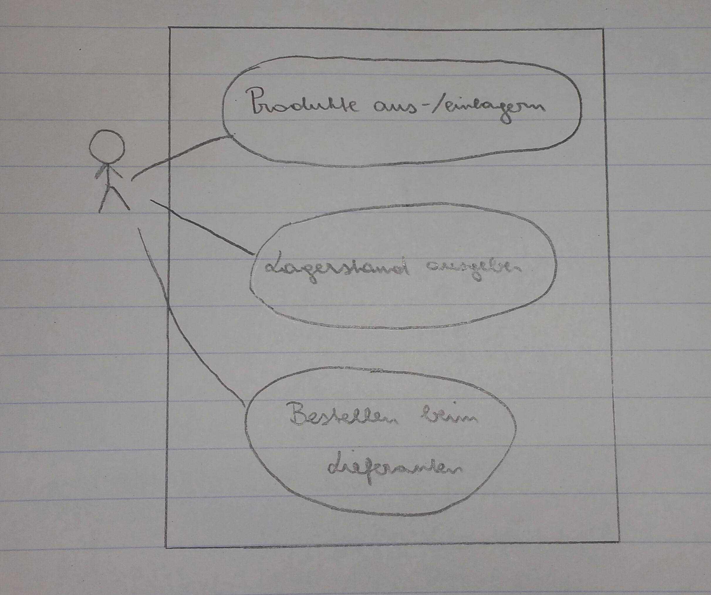

Pflichtenheft Lagerverwaltung
=============================

Projektbezeichnung |Lagerverwaltung
------------------ | ---------------
**Projektleiter**  | Stefan Leithenmayr
**Erstellt am**    | 16. November 2017
**Stakeholder**    | Rene Deicker, Maximilian Hofer
**Zuletzt geändert** | 18. November 2017

Änderungsverzeichnis

Nr. | Datum | Version | Geänderte Kapitel | Beschreibung der Änderung | Autor
------------------ | ---------------|---|---|---|--
1 | 18. November 2017 | 0.1 | Alle | Erstellung | Stefan Leithenmayr
2 | 25. November 2017 | 0.2 | Alle | Esrweiterung| Stefan Leithenmayr
3 | 26. November 2017 | 0.3 | Abnahmekriterien, Lieferumfang | Erweiterung| Maximilian Hofer

Inhaltsverzeichnis
========

> - Motivation
> - Ausgangssituation und Zielsetzung
>    - Ausgangssituation
>    - Ist - Zustand 
>    - Zielbestimmung
>    - Glossar
>    - Diagramm des Problembereiches
> - Funktionale Anforderungen
>    - Use Case Diagramm
>    - GUI
> - Nicht funktionale Anforderungen
> - Mengengerüst
> - Lieferumfang
> - Abnahmekriterien

1.Motivation
================

Unser Projekt wird im Rahmen des Unterrichtfaches Projektentwicklung durchgeführt.
Unsere Motivation ist, dass wir unsere Java - Kenntnisse erweitern möchten.
Weiteres ist unsere Hauptmotivation möglichst viel zu lernen, 
bezüglich der Durchführung eines Projektes.

2.Ausgangssituation und Zielsetzung
============
2.1 Ausgangssituation
---------------------

Wir haben uns für dieses Projekt entschieden,da eine Lagerverwaltung ohne der passenden 
Software sehr schwierig ist. 

Vorteile gegenüber der nicht softwareunterstützten Lagerverwaltung ist, dass
man den Lagerstand auf einen Blick sehen kann, Produkte schnell ein-/auslagern kann und
Lagerbewegungen der letzten Zeit auf einen Blick sehen kann.

Die relevanten Stakeholder sind Rene Deicker, Maximilian Hofer und Stefan Leithenmayr.

2.1.1 Ist - Zustand
-------------------

Unser Projekt setzt auf kein bereits, 
bestehendes Projekt auf.

2.1.2 Beschreibung des Problembereiches
---------------------------------------
Das Hauptproblem eines Lagers ist,
dass Lagergüter möglichst zeiteffizient gefunden werden müssen, 
da wenn man Ewigkeiten nach dem Produkt suchen muss, 
kostet das enorm viel Zeit. 
Ein weiteres Problem ist, wenn der Lagerbestand eines Produktes gleich null ist.
Wird dieses Produkt in der Produktion benötigt, 
es aber nicht mehr lagernd ist, 
kann es zu Lieferverzögerungen kommen und in Folge dessen
zu Pönalzahlungen seitens unserer Mandanten kommen.

Außerdem muss man die Güter,
die eine relativ hohe Umschlagshäufigkeit haben,
möglichst leicht zugänglich machen.

2.1.3 Glossar
--------

Fachbegriff | Beschreibung|
------------------ | ---------------|
Meldemenge | Menge ab der bestellt werden muss
Sicherheitsmenge | Menge die immer vorhanden muss, dass es zu keinen Verzögerungen kommt
Umschlagshäufigkeit | Häufigkeit wie oft ein Produkt raus bzw. ins Lager geht
Pönale | Strafzahlung
Journal | Dort sieht man die Lagerbewegungen (Ein -/ Auslagerungen)
Mandant | Kunde der unser Programm verwendet
Lieferant | Personen die den Mandanten beliefern
Produkt | Sind die Produkte die unsere Mandanten einlagern
Lager | Jeder Mandant kann mehrere Lager haben

2.1.4 Modell des Problembereiches
---

3.Funktionale Anforderungen
========

3.1 Use Case Diagramm
----

> - Ein bzw. Auslagern von Produkte
> - Lagerstand darstellen
> - Beim Lieferanten bestellen
> - Journal eines Zeitraumes sehen
> - Lieferanten verwalten

4.Nicht funktionale Anforderungen
==============

> - Das System muss den unautorisierten Zugriff auf die Kundenstammdaten
  verhindern, soweit dies technisch möglich ist
> - SQL - Server
> - Möglichst geringer Ressourcenverbrauch
> - Schnelle Datenabfragen, ansonsten entstehen Wartezeiten

5.Mengengerüst
============

Es fallen die Daten an, die Sie im Kaptiel 2.1.4 (Modell des Problembereiches) in dem Klassendiagramm finden.

6.Lieferumfang
===
Im Lieferumfang befindet sich

> - Fertige Software
> - Bedienungsanleitung für die Software

7.Abnahmekriterien
========
Abnahmekriterien sind

> - Läuft die Datenbank ordnungsgemäß?
> - Funktioniert das Programm entsprechend den Anforderungen?
> - Funktioniert das Ein- Auslagern?
> - Lieferung muss
>     - vollständig
>     - pünktlich beim Kunden ankommen
> - Software muss auf dem PC vom Kunden funktionieren und darf keine Bugs aufweisen
