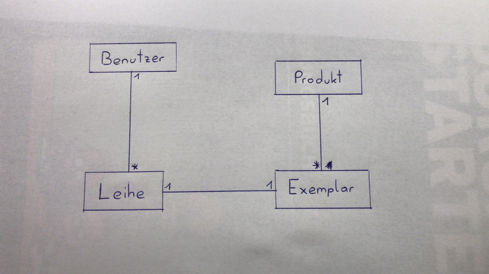
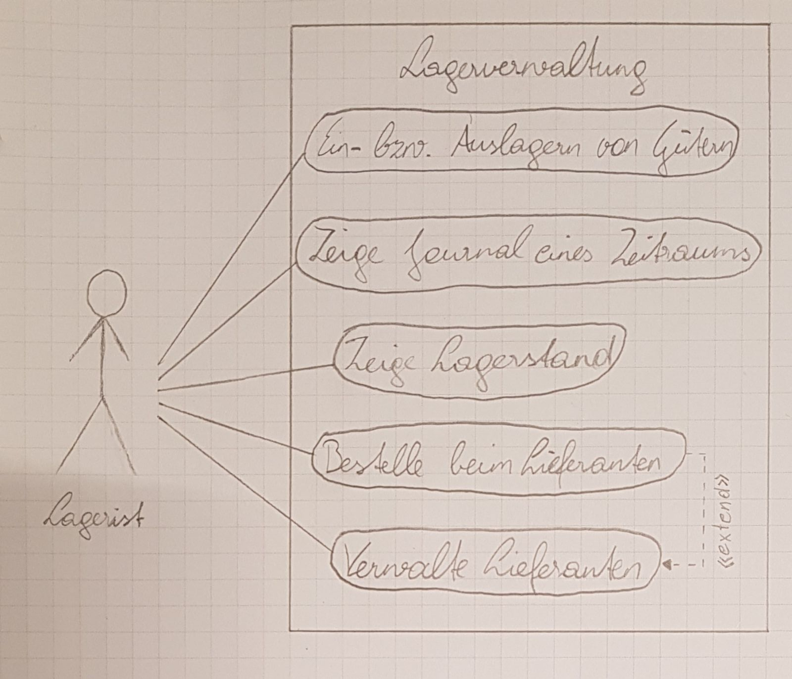
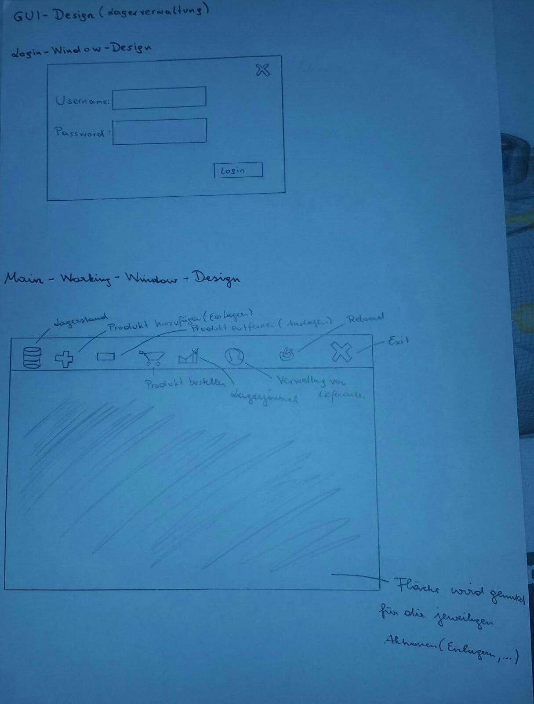

Pflichtenheft Lagerverwaltung
=============================

Projektbezeichnung |Lagerverwaltung
------------------ | ---------------
**Projektleiter**  | Stefan Leithenmayr
**Erstellt am**    | 16. November 2017
**Mitwirkende**    | Rene Deicker, Maximilian Hofer
**Zuletzt geändert** | 6. Februar 2018

Änderungsverzeichnis
-----

Nr. | Datum | Version | Geänderte Kapitel | Beschreibung der Änderung | Autor
------------------ | ---------------|---|---|---|--
1 | 18. November 2017 | 0.1 | Alle | Erstellung | Stefan Leithenmayr
2 | 25. November 2017 | 0.2 | Alle | Erweiterung| Stefan Leithenmayr
3 | 26. November 2017 | 0.3 | Abnahmekriterien, Lieferumfang | Erweiterung| Maximilian Hofer
4 | 1. Dezember 2017  | 0.4 | Alle + Diagramme | Erweiterung | René Deicker, Stefan Leithenmayr
5 | 5. Februar 2018  | 0.5 | Alle | Überarbeitung | René Deicker
6 | 6. Februar 2018  | 0.6 | Alle | Überarbeitung | Maximilian Hofer

Inhaltsverzeichnis
========

> - Motivation
> - Ausgangssituation und Zielsetzung
>    - Ausgangssituation
>    - Ist - Zustand 
>    - Beschreibung des Problembereiches
>    - Glossar
>    - Modell des Problembereiches
>    - Beschreibung des Geschäftsfeldes
>    - Beschreibung der Geschäftsprozesse
>    - Zielbestimmung
> - Funktionale Anforderungen
>    - Use Case Diagramm
>    - GUI
> - Nicht funktionale Anforderungen
> - Mengengerüst
> - Lieferumfang
> - Abnahmekriterien
> - Literaturverzeichnis

1.Motivation
================

Unser Projekt wird im Rahmen des Unterrichtfaches Projektentwicklung durchgeführt.
Unsere Motivation ist, dass wir unsere Java - Kenntnisse vertiefen möchten.
Weiteres ist unsere Hauptmotivation möglichst viel zu lernen, 
bezüglich der Durchführung eines Projektes.

2.Ausgangssituation und Zielsetzung
============

2.1 Ausgangssituation
---------------------
Aufgrund dessen, dass es derzeit kein ordentliches Verwatlungssystem gibt, welches die Gegenstände im RoboLab verwaltet, erstellen wir dieses System.

2.1.1 Beschreibung des Problembereiches
---------------------------------------
Das Hauptproblem des RoboLab ist, dass Lagergüter möglichst zeiteffizient gefunden werden sollen.
Ein weiteres Problem ist, dass einige Gegenstände schwer zu finden sind bzw. nicht dort hingelegt werden wo sie genommen worden. Aber auch Verluste sind leicht möglich.

2.1.2 Glossar
--------

Fachbegriff | Beschreibung|
------------------ | ---------------|
Meldemenge | Menge ab der bestellt werden muss
Sicherheitsmenge | Menge die immer vorhanden muss, dass es zu keinen Verzögerungen kommt
Umschlagshäufigkeit | Häufigkeit wie oft ein Produkt raus bzw. ins Lager geht
Pönale | Strafzahlung
Journal | Dort sieht man die Lagerbewegungen (Ein -/ Auslagerungen)
Mandant | Kunde der unser Programm verwendet
Lieferant | Personen die den Mandanten beliefern
Produkt | Sind die Produkte die unsere Mandanten einlagern
Lager | Jeder Mandant kann mehrere Lager haben

2.1.3 Modell des Problembereiches
---

2.1.4 Beschreibung des Geschäftsfeldes
---

2.1.5 Beschreibung der Geschäftsprozesse
---------------------------------------

Name des Geschäftsprozesses | Auslösendes Ereignis | Ergebnis | Mitwirkende
------------------ | ---------------|----------|-----------------
Ein bzw. Auslagern von Gütern| Produkt soll zum Lager hinzugefügt oder entfernt werden  | Produkt das entnommen wurde wird auch im Programm entfernt oder Produkt das eingelagert wurde wird auch im Programm entfernt | Lagerist
Zeige Lagerstand | Lagerist möchte wissen, was sich noch im Lager befindet | Lagerstand wird gezeigt | Lagerist
Bestelle beim Lieferanten  | Lagerist benötigt Güter | Bestellung | Lagerist
Zeige Journal eines Zeitraumes  | Ein -/ Auslagerungen der letzten Zeit werden benötigt | Liste der Ein -/ Auslagerungen | Lagerist
Verwalte Lieferanten | Lieferantendaten wurden geändert | Geänderte Lieferantendaten | Lagerist

2.2 Zielbestimmung
-----------------
Wir erstellen unsere Software um die Verwaltung der Produkte im RoboLab zu vereinfachen.

>- Güter können zeiteffizient ein-/ausgelagert werden
>- Journal eines gewissen Zeitraumes kann auf einen Blick betrachtet werden
>- Aktueller Lagerstand kann dargestellt werden
>- Beim Lieferanten kann bestellt werden kann 
>- Lieferanten können verwaltet werden 

3.Funktionale Anforderungen
========

3.1 Use Case Diagramm
--------------------

**Geschäftsprozesse**

> - Ein bzw. Auslagern von Gütern
> - Lagerstand zeigen
> - beim Lieferanten bestellen 
> - Journal eines Zeitraumes zeigen
> - Lieferanten verwalten

3.2 GUI
--------

4.Nicht funktionale Anforderungen
==============

> - Das System muss den unautorisierten Zugriff auf die Stammdaten
  verhindern, soweit dies technisch möglich ist
> - SQL - Server
> - Möglichst geringer Ressourcenverbrauch
> - Schnelle Datenabfragen, ansonsten entstehen Wartezeiten

5.Mengengerüst
============

Es fallen die Daten an, die Sie im Kapitel 2.1.4 (Modell des Problembereiches) in dem Klassendiagramm finden.
Die anfallenden Datenmengen kann man in diesem Fall nicht pauschal beurteilen, da wir z.B. die Anzahl der User nicht wisssen.

6.Lieferumfang
===
Im Lieferumfang befindet sich

> - Fertige Software
> - Bedienungsanleitung für die Software

7.Abnahmekriterien
========
Abnahmekriterien sind

> - Läuft die Datenbank ordnungsgemäß?
> - Funktioniert das Programm entsprechend den Anforderungen?
> - Funktioniert das Ein- bzw. Auslagern?
> - Auslieferung muss
>     - vollständig und
>     - pünktlich ankommen
> - Software muss auf den Pc´s des RoboLab laufen und darf keine Bugs aufweisen

8.Literaturverzeichnis
=====================

Tobias Ambrosch: Die Lagerverwaltung
https://blog.selectline.de/die-lagerverwaltung/ (1.12.2017)
