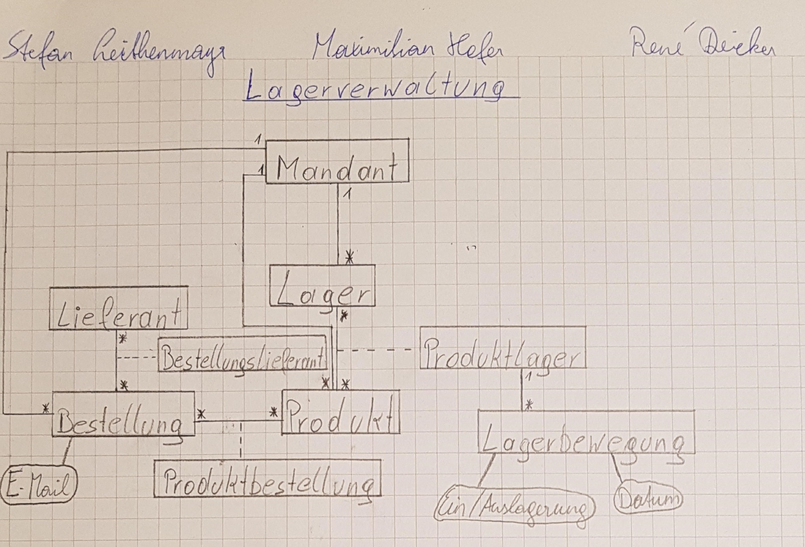
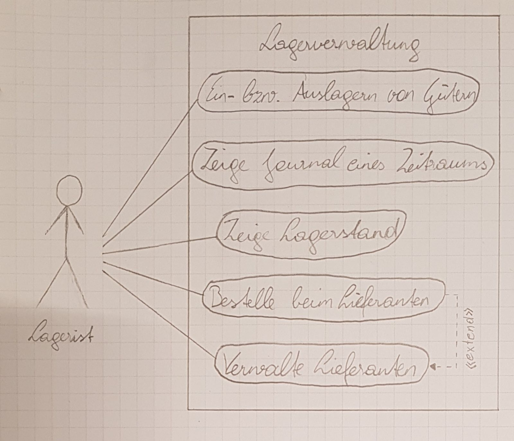
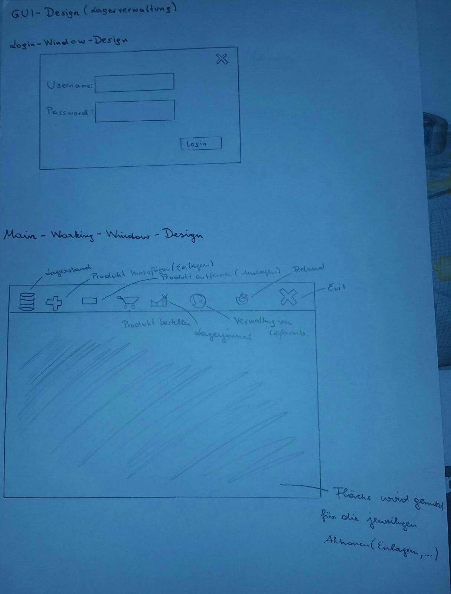

Pflichtenheft Lagerverwaltung
=============================

Projektbezeichnung |Lagerverwaltung
------------------ | ---------------
**Projektleiter**  | Stefan Leithenmayr
**Erstellt am**    | 16. November 2017
**Stakeholder**    | Rene Deicker, Maximilian Hofer
**Zuletzt geändert** | 1. Dezember 2017

Änderungsverzeichnis

Nr. | Datum | Version | Geänderte Kapitel | Beschreibung der Änderung | Autor
------------------ | ---------------|---|---|---|--
1 | 18. November 2017 | 0.1 | Alle | Erstellung | Stefan Leithenmayr
2 | 25. November 2017 | 0.2 | Alle | Erweiterung| Stefan Leithenmayr
3 | 26. November 2017 | 0.3 | Abnahmekriterien, Lieferumfang | Erweiterung| Maximilian Hofer
4 | 1. Dezember 2017  | 0.4 | Alle + Diagramme | Erweiterung | Rene Deicker, Stefan Leithenmayr

Inhaltsverzeichnis
========

> - Motivation
> - Ausgangssituation und Zielsetzung
>    - Ausgangssituation
>    - Ist - Zustand 
>    - Beschreibung des Problembereiches
>    - Glossar
>    - Modell des Problembereiches
>    - Beschreibung des Geschäftsfeldes
>    - Beschreibung der Geschäftsprozesse
>    - Zielbestimmung
> - Funktionale Anforderungen
>    - Use Case Diagramm
>    - GUI
> - Nicht funktionale Anforderungen
> - Mengengerüst
> - Lieferumfang
> - Abnahmekriterien
> - Literaturverzeichnis

1.Motivation
================

Unser Projekt wird im Rahmen des Unterrichtfaches Projektentwicklung durchgeführt.
Unsere Motivation ist, dass wir unsere Java - Kenntnisse vertiefen möchten.
Weiteres ist unsere Hauptmotivation möglichst viel zu lernen, 
bezüglich der Durchführung eines Projektes.

2.Ausgangssituation und Zielsetzung
============
2.1 Ausgangssituation
---------------------

Wir haben uns für dieses Projekt entschieden, da eine Lagerverwaltung ohne der passenden 
Software sehr aufwendig und mühsam für kleine Unternehmen ist. Außerdem können Ungenauigkeiten entstehen. (Quelle siehe Literaturverzeichnis)

Vorteile gegenüber der nicht softwareunterstützten Lagerverwaltung ist, dass
man den Lagerstand auf einen Blick sehen kann, Produkte schnell ein-/auslagern kann,
Lagerbewegungen der letzten Zeit auf einen Blick sehen kann und Produktstellplätze schnell ausfindig machen kann.

Die relevanten Stakeholder sind Rene Deicker, Maximilian Hofer und Stefan Leithenmayr.

2.1.1 Ist - Zustand
-------------------

Kleine Firmen können sich keine teure und qualitativ hochwertige Lagerveraltungssoftware leisten, daher haben sie entweder keine oder sind unzufrieden mit ihrer derzeitigen Lösung.

2.1.2 Beschreibung des Problembereiches
---------------------------------------
Unsere fertige Software soll, im Bereich der Lagerverwaltung eingesetzt werden.

Das Hauptproblem eines Lagers ist,
dass Lagergüter möglichst zeiteffizient gefunden werden müssen.
Ein weiteres Problem ist, wenn der Lagerbestand eines Produktes gleich null ist.
Wird dieses Produkt in der Produktion benötigt, 
es aber nicht mehr lagernd ist, 
kann es zu Lieferverzögerungen kommen und in Folge dessen
zu Pönalzahlungen seitens unserer Mandanten kommen.

Außerdem muss man die Güter,
die eine relativ hohe Umschlagshäufigkeit haben,
möglichst leicht zugänglich machen.

2.1.3 Glossar
--------

Fachbegriff | Beschreibung|
------------------ | ---------------|
Meldemenge | Menge ab der bestellt werden muss
Sicherheitsmenge | Menge die immer vorhanden muss, dass es zu keinen Verzögerungen kommt
Umschlagshäufigkeit | Häufigkeit wie oft ein Produkt raus bzw. ins Lager geht
Pönale | Strafzahlung
Journal | Dort sieht man die Lagerbewegungen (Ein -/ Auslagerungen)
Mandant | Kunde der unser Programm verwendet
Lieferant | Personen die den Mandanten beliefern
Produkt | Sind die Produkte die unsere Mandanten einlagern
Lager | Jeder Mandant kann mehrere Lager haben

2.1.4 Modell des Problembereiches
---

2.1.5 Beschreibung des Geschäftsfeldes
---

2.1.6 Beschreibung der Geschäftsprozesse
---------------------------------------

Name des Geschäftsprozesses | Auslösendes Ereignis | Ergebnis | Mitwirkende
------------------ | ---------------|----------|-----------------
Ein bzw. Auslagern von Gütern| Produkt kommt hinzu oder soll entfernt werden  | Produkt, dass entnommen wurde, wird auch im Programm entfernt, oder Produkt das eingelagert wurde, wird auch im Programm entfernt | Lagerist
Zeige Lagerstand | Lagerist möchte wissen, was sich noch im Lager befindet | Sieht den Lagerstand | Lagerist
Bestelle beim Lieferanten  | Lagerist benötigt Produkte | Bestellung | Lagerist
Zeige Journal eines Zeitraumes  | Ein -/ Auslagerungen der letzten Zeit werden benötigt | Liste der Ein -/ Auslagerungen | Lagerist
Verwalte Lieferanten | Lieferantendaten wurden geändert | Geänderte Lieferantendaten | Lagerist

2.2 Zielbestimmung
-----------------
Wir erstellen unsere Software um kleine Unternehmen im Bereich der Lagerverwaltung unter die Arme zu greifen. 
Unser Ziel ist es, Produkte möglichst zeiteffizient ein-/auslagern zu können, Journal ansehen, Lagerstand darstellen, beim Lieferanten bestellen und die Lieferanten zu verwalten.

Die Zielgruppe sind Lageristen und vor allem kleine Unternehmen, die eine Lagerverwaltungssoftware für ihr Lager benötigen.
Es ist davon auszugehen, dass sich ein Lagerist mit den Abläufen eines Lagers auskennt.

3.Funktionale Anforderungen
========

3.1 Use Case Diagramm
--------------------

**Geschäftsprozesse**

> - Ein bzw. Auslagern von Gütern
> - Zeige Lagerstand 
> - Bestelle beim Lieferanten 
> - Zeige Journal eines Zeitraumes 
> - Verwalte Lieferanten 

3.2 GUI
--------

4.Nicht funktionale Anforderungen
==============

> - Das System muss den unautorisierten Zugriff auf die Kundenstammdaten
  verhindern, soweit dies technisch möglich ist
> - SQL - Server
> - Möglichst geringer Ressourcenverbrauch
> - Schnelle Datenabfragen, ansonsten entstehen Wartezeiten

5.Mengengerüst
============

Es fallen die Daten an, die Sie im Kapitel 2.1.4 (Modell des Problembereiches) in dem Klassendiagramm finden.

6.Lieferumfang
===
Im Lieferumfang befindet sich

> - Fertige Software
> - Bedienungsanleitung für die Software

7.Abnahmekriterien
========
Abnahmekriterien sind

> - Läuft die Datenbank ordnungsgemäß?
> - Funktioniert das Programm entsprechend den Anforderungen?
> - Funktioniert das Ein- Auslagern?
> - Lieferung muss
>     - vollständig
>     - pünktlich beim Kunden ankommen
> - Software muss auf dem PC vom Kunden funktionieren und darf keine Bugs aufweisen

8.Literaturverzeichnis
=====================

Tobias Ambrosch: Die Lagerverwaltung
https://blog.selectline.de/die-lagerverwaltung/ (1.12.2017)
